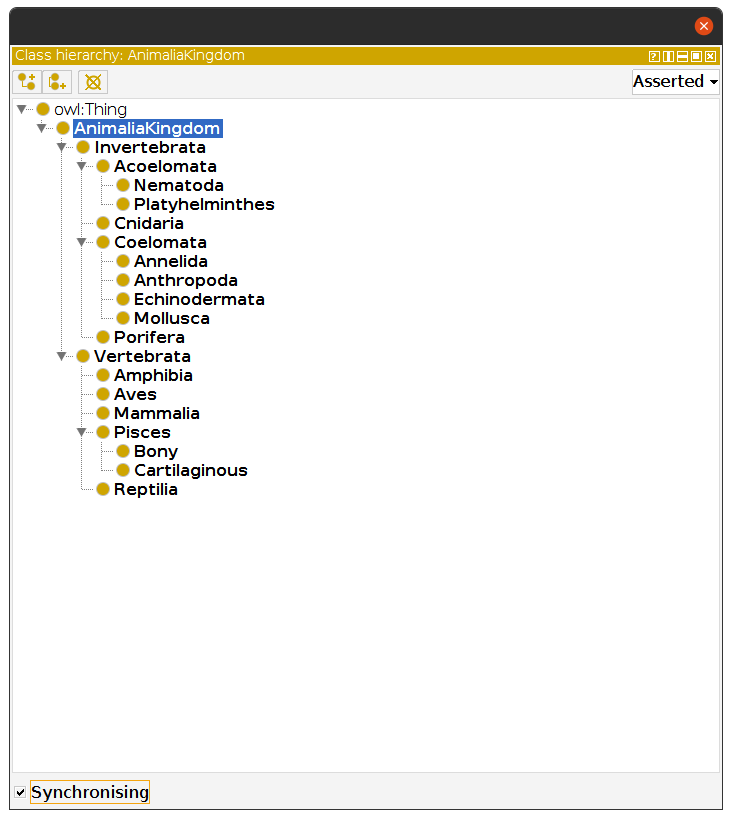

<p>
  <!-- <a href="">
    
  </a> -->

  <a href="">
    
  </a>
</p>

# Animalia Kingdom Representation using Owlready2 based Ontology

## Abstract

<p align="justify">
In this work, I address the task of  “Animalia Kingdom Representation using Owlready2 based Ontology” for the DSE309 Advanced Programming in Python course. The Animalia Kingdom is a large group that consists of eukaryotic, multicellular organisms that are heterotrophic in nature. It is broadly divided into two classes (or groups), i.e., invertebrates and vertebrates. These two classes are further divided into multiple sub-classes. I have tried to represent the hierarchical structure of the Animalia Kingdom into an ontology using the Owlready2 package. The ontology is then visualized using the Protégé tool developed by the Stanford Center for Biomedical Informatics Research.
</p>

## Introduction

<p align="justify">
Animals (also called Metazoa) are multicellular, eukaryotic organisms in the biological kingdom Animalia. With few exceptions, animals consume organic material, breathe oxygen, can move, reproduce sexually, and go through an ontogenetic stage in which their body consists of a hollow sphere of cells, the blastula, during embryonic development [1]. In general, animals are divided into two main groups namely, vertebrates (animals with a backbone) and invertebrates (animals that lack a backbone) [2]. The classification of Animalia Kingdom is shown in the figure below:
</p>

<p align="center">
 
</p>

<p align="center">
<b>Figure 1.</b> Animalia Kingdom Classification
</p>

<p align="center">
 
</p>

<p align="center">
<b>Figure 2.</b> Animalia Kingdom [1]
</p>

## Owlready2 Package

<p align="justify">
<a href= "https://owlready2.readthedocs.io/en/v0.32/">Owlready2</a> [3] is a package for ontology-oriented programming in Python. It can load OWL 2.0 ontologies as Python objects, modify them, save them, and perform reasoning via HermiT (included). Owlready2 allows transparent access to OWL ontologies (contrary to the usual Java-based API).
</p>

## Protégé Editor

<p align="justify">
<a href= "https://protege.stanford.edu/">Protégé</a> [4] is a free, open-source ontology editor and knowledge-base framework. The Protégé platform supports two main ways of modeling ontologies via the Protégé-Frames and Protégé-OWL editors. Protégé ontologies can be exported into a variety of formats including RDF, RDFS, OWL, and XML Schema. Protégé is based on Java, is extensible, and provides a plug-and-play environment that makes it a flexible base for rapid prototyping and application development.
</p>

## Creating Ontology using Owlready2

### Creating an Empty Ontology

<p align="justify">
A new empty ontology can be obtained with the get_ontology() function; it takes a single parameter, the IRI of the ontology. The IRI is a sort of URL; IRIs are used as identifiers for ontologies. The following code snippet is used for creating an empty ontology:
</p>

```python
onto = get_ontology("http://test.org/onto.owl/")
```

### Creating the Main Class for the Animalia Kingdom

<p align="justify">
The following code snippet is used for creating the AnimaliaKingdom class:
</p>

```python
set_log_level(9) # modifies the level of logging/verbose

with onto:
    class AnimaliaKingdom(Thing):pass
    
print(list(onto.classes()))
```
<p align="justify">
In the snippet above, the parent class for the AnimaliaKingdom class is Thing, which is defined in the ‘owl’ ontology. The set_log_level(9) function modifies the level of logging. By setting the level to its maximum (9), Owlready indicates the RDF triples added, deleted, or modified in the quad store. Here is the output: 
</p>

```
[onto.AnimaliaKingdom]
* Owlready2 * ADD TRIPLE http://test.org/onto.owl/AnimaliaKingdom http://www.w3.org/1999/02/22-rdf-syntax-ns#type http://www.w3.org/2002/07/owl#Class
* Owlready2 * ADD TRIPLE http://test.org/onto.owl/AnimaliaKingdom http://www.w3.org/2000/01/rdf-schema#subClassOf http://www.w3.org/2002/07/owl#Thing
```

### Creating Sub-Classes

<p align="justify">
The following code snippet is used for creating sub-classes for the Phyla:
</p>

```python
# Invertebrata
class Invertebrata(AnimaliaKingdom):pass
class Porifera(Invertebrata):pass
class Cnidaria(Invertebrata):pass
class Acoelomata(Invertebrata):pass
class Platyhelminthes(Acoelomata):pass
class Nematoda(Acoelomata):pass
class Coelomata(Invertebrata):pass
class Annelida(Coelomata):pass
class Anthropoda(Coelomata):pass
class Mollusca(Coelomata):pass
class Echinodermata(Coelomata):pass

# Vertebrata
class Vertebrata(AnimaliaKingdom):pass
class Pisces(Vertebrata):pass
class Cartilaginous(Pisces):pass
class Bony(Pisces):pass
class Amphibia(Vertebrata):pass
class Reptilia(Vertebrata):pass
class Aves(Vertebrata):pass
class Mammalia(Vertebrata):pass

print(list(onto.classes()))
```
### Adding Annotations for Classes/Sub-Classes from the Animalia_Kingdom Dictionary

<p align="justify">
The Animalia_Kingdom dictionary is defined in a hierarchical manner containing Phyla and their examples:
</p>

```python
Animalia_Kingdom = {
    'Invertebrata':{
        'Porifera': 'Euplectella, Sycon, Spongilla',
        'Cnidaria': 'Hydra, Sea anemone',
        'Acoelomata': {
            'Platyhelminthes':'Planaria, Liverfluke, Tape worm',
            'Nematoda': 'Ascaris, Wuchereria'
        },
        'Coelomata':{
            'Annelida': 'Nereis, Earthworm, Leech',
            'Anthropoda': 'Aranea, Palaemon, Musca',
            'Mollusca': 'Chiton, Octopus, Pila',
            'Echinodermata': 'Antedon, Echinus, Asterias'
        }
    },
    Vertebrata: {
        'Pisces': {
            'Cartilaginous': 'Sting ray, Electric ray, Scolidon',
            'Bony': 'Exocoetus, Anabas'
        },
        'Amphibia':'Salamander, Toad, Hyla',
        'Reptilia': 'Turtle, Chameleon',
        'Aves': 'Ostrich, Pigeon, Crow',
        'Mammalia': 'Human, Cat, Whale'
    }
}
```

<p align="justify">
The classes in the AnimaliaKingdom ontology are annotated using the examples given in the above dictionary. Nested for loops and if-elif statements are extensively used for this task. For adding annotations in the classes, locstr(), (i.e., localized string function) is used, it supports language-specific comments.
</p>


```python
for class_ in Animalia_Kingdom:
    if (class_ == 'Invertebrata'):
        for phylum in Animalia_Kingdom[class_]:
            if (phylum == 'Porifera'):
                Porifera.comment = locstr(f"Examples: {Animalia_Kingdom[class_][phylum]}", lang= 'en')
            elif (phylum == 'Cnidaria'):
                Cnidaria.comment = locstr(f"Examples: {Animalia_Kingdom[class_][phylum]}", lang= 'en')
            elif (phylum == 'Acoelomata'):
                for phylum_1 in Animalia_Kingdom[class_][phylum]:
                    if (phylum_1 == 'Platyhelminthes'):
                        Platyhelminthes.comment = locstr(f"Examples: {Animalia_Kingdom[class_][phylum][phylum_1]}", lang= 'en')
                    elif (phylum_1 == 'Nematoda'):
                        Nematoda.comment = locstr(f"Examples: {Animalia_Kingdom[class_][phylum][phylum_1]}", lang= 'en')
            elif (phylum == 'Coelomata'):
                for phylum_1 in Animalia_Kingdom[class_][phylum]:
                    if (phylum_1 == 'Annelida'):
                        Annelida.comment = locstr(f"Examples: {Animalia_Kingdom[class_][phylum][phylum_1]}", lang= 'en')
                    elif (phylum_1 == 'Anthropoda'):
                        Anthropoda.comment = locstr(f"Examples: {Animalia_Kingdom[class_][phylum][phylum_1]}", lang= 'en')
                    elif (phylum_1 == 'Mollusca'):
                        Mollusca.comment = locstr(f"Examples: {Animalia_Kingdom[class_][phylum][phylum_1]}", lang= 'en')
                    elif (phylum_1 == 'Echinodermata'):
                        Echinodermata.comment = locstr(f"Examples: {Animalia_Kingdom[class_][phylum][phylum_1]}", lang= 'en')
    elif (class_ == 'Vertebrata'):
        for phylum in Animalia_Kingdom[class_]:
            if (phylum == 'Pisces'):
                for phylum_1 in Animalia_Kingdom[class_][phylum]:
                    if (phylum_1 == 'Cartilaginous'):
                        Cartilaginous.comment = locstr(f"Examples: {Animalia_Kingdom[class_][phylum][phylum_1]}", lang= 'en')
                    elif (phylum_1 == 'Bony'):
                        Bony.comment = locstr(f"Examples: {Animalia_Kingdom[class_][phylum][phylum_1]}", lang= 'en')
            elif (phylum == 'Amphibia'):
                Amphibia.comment = locstr(f"Examples: {Animalia_Kingdom[class_][phylum]}", lang= 'en')
            elif (phylum == 'Reptilia'):
                Reptilia.comment = locstr(f"Examples: {Animalia_Kingdom[class_][phylum]}", lang= 'en')
            elif (phylum == 'Aves'):
                Aves.comment = locstr(f"Examples: {Animalia_Kingdom[class_][phylum]}", lang= 'en')
            elif (phylum == 'Mammalia'):
                Mammalia.comment = locstr(f"Examples: {Animalia_Kingdom[class_][phylum]}", lang= 'en')
```

### Saving Ontology to OWL File

<p align="justify">
The .save() method is used to save ontology to an OWL file.
</p>

```python
onto.save('AnimaliaKingdom.owl', format = "rdfxml")
```

## Visualizing the Ontology in Protégé Editor

### Class Hierarchy

<p align="center">
 
</p>

<p align="center">
<b>Figure 3.</b> Visualizing class hierarchy in Protégé editor
</p>

### Sub/Super Classes Details

<p align="center">
 
</p>

<p align="center">
<b>Figure 4.</b>  Sub/Super classes details in Protégé editor
</p>

### Annotations (Comment)

<p align="justify">
The following figures show the annotations of the Platyhelminthes and Mammalia class:
</p>

<p align="center">
 
</p>

<p align="center">
<b>Figure 5.1.</b> (a) Annotations of the Platyhelminthes class
</p>

<p align="center">
 
</p>

<p align="center">
<b>Figure 5.2.</b> (b) Annotations of the Mammalia class
</p>

## Conclusions

<p align="justify">
In this repository, I have described the approach to make an ontology, based on the Animalia Kingdom using the Owlready2 package. Several methods of the library were explored and used for the same. Apart from this, the ontology was also visualized using the Protégé editor. The hierarchical structure of the ontology was represented in an organized layout in the editor. Various parameters of the classes/sub-classes were also explored using the editor.
</p>

## References

1. "Animal- Wikipedia", *En.wikipedia.org*. [Online]. Available: https://en.wikipedia.org/wiki/Animal. [Accessed: 14- Sep- 2021]
2. "Kingdom Animalia - Different Phylum, Classification, Characteristics", *MicroscopeMaster*. [Online]. Available: https://www.microscopemaster.com/kingdom-animalia.html. [Accessed: 14- Sep- 2021]
3. Lamy JB. Owlready: Ontology-oriented programming in Python with automatic classification and high level constructs for biomedical ontologies. Artificial Intelligence In Medicine 2017; 80:11-28
4. Stanford Center for Biomedical Informatics Research, "Protégé", *Protege.stanford.edu*. [Online]. Available: https://protege.stanford.edu/. [Accessed: 14- Sep- 2021]